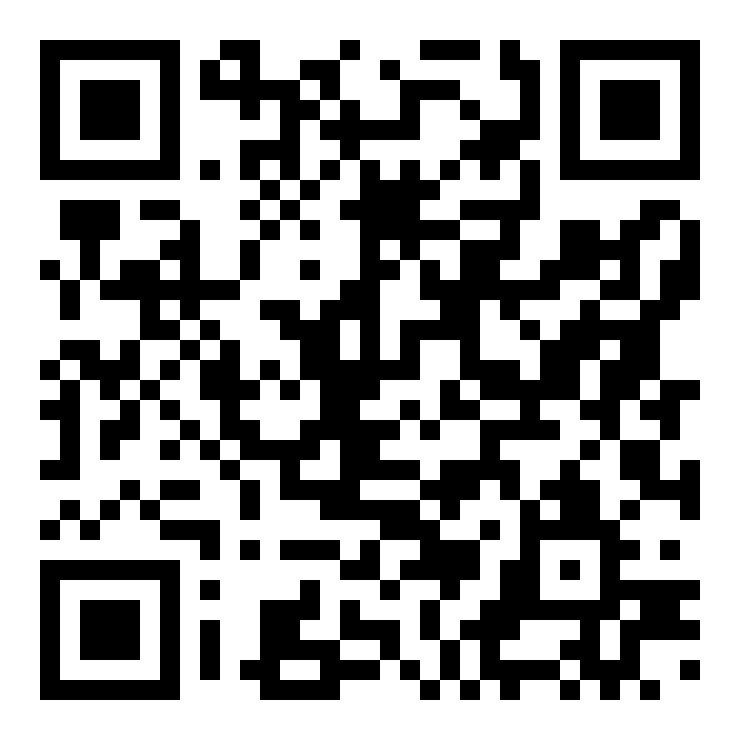
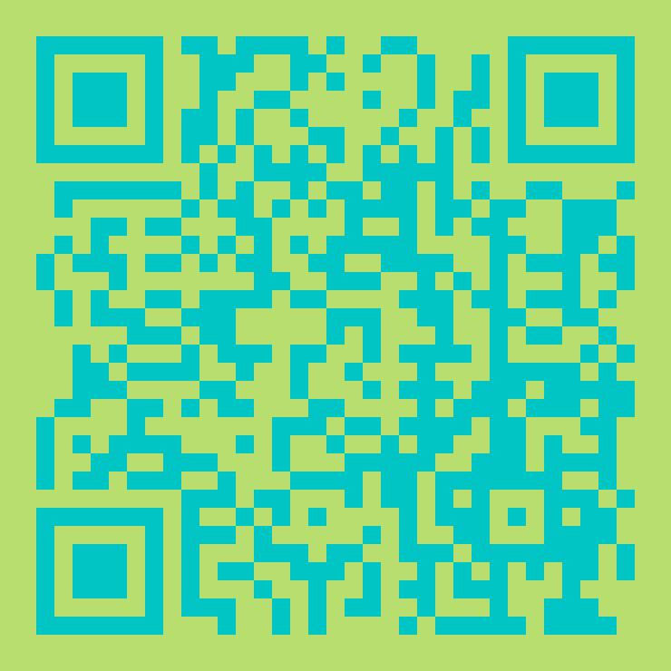
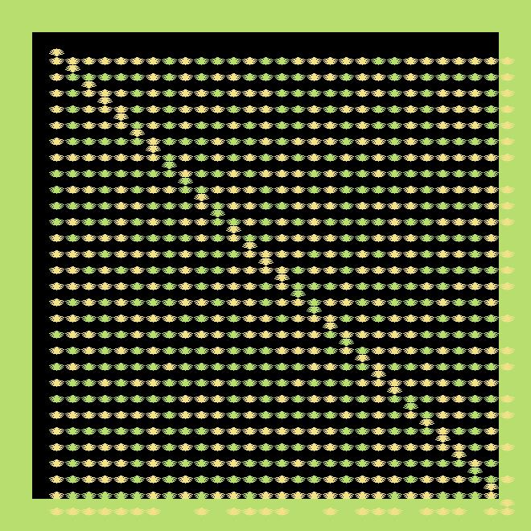

# go-qrcode #

[](https://goreportcard.com/report/github.com/yeqown/go-qrcode) [](https://pkg.go.dev/github.com/yeqown/go-qrcode)
[](https://github.com/yeqown/go-qrcode/actions/workflows/go.yml)


QR code (abbreviated from Quick Response Code) is the trademark for a type of matrix barcode (or two-dimensional barcode) first designed in 1994 for the automotive industry in Japan. A barcode is a machine-readable optical label that contains information about the item to which it is attached. A QR code uses four standardized encoding modes (numeric, alphanumeric, byte/binary, and kanji) to store data efficiently; extensions may also be used

### Features

- [x] Normally generate QR code across `version 1` to `version 40`.
- [x] Automatically analyze QR version by source text.
- [x] Specifying cell shape allowably with `WithCustomShape`, `WithCircleShape` (default is `rectangle`)
- [x] Specifying output file's format with `WithBuiltinImageEncoder`, `WithCustomImageEncoder` (default is `JPEG`)
- [x] Not only shape of cell, but also color of QR Code background and foreground color.
- [x] `WithLogoImage`, `WithLogoImageFilePNG`, `WithLogoImageFileJPEG` help you add an icon at the central of QR Code.
- [x] `WithBorderWidth` allows to specify any width of 4 sides around the qrcode.

### Install

```sh
go get -u github.com/yeqown/go-qrcode
```

### Usage

link to [CODE](./example/main.go)
```go
package main

import (
	"fmt"

	qrcode "github.com/yeqown/go-qrcode"
)

func main() {
	qrc, err := qrcode.New("https://github.com/yeqown/go-qrcode")
	if err != nil {
		fmt.Printf("could not generate QRCode: %v", err)
	}

	// save file
	if err := qrc.Save("../testdata/repo-qrcode.jpeg"); err != nil {
		fmt.Printf("could not save image: %v", err)
	}
}
```

### Options

now `go-qrcode` provides some options to customize output QRCode.

```go
// WithBgColor background color
func WithBgColor(c color.Color) ImageOption {}

// WithBgColorRGBHex background color
func WithBgColorRGBHex(hex string) ImageOption {}

// WithFgColor QR color
func WithFgColor(c color.Color) ImageOption {}

// WithFgColorRGBHex Hex string to set QR Color
func WithFgColorRGBHex(hex string) ImageOption {}

// WithLogoImage .
func WithLogoImage(img image.Image) ImageOption {}

// WithLogoImageFilePNG load image from file, PNG is required
func WithLogoImageFilePNG(f string) ImageOption {}

// WithLogoImageFileJPEG load image from file, JPEG is required
func WithLogoImageFileJPEG(f string) ImageOption {}

// WithQRWidth specify width of each qr block
func WithQRWidth(width uint8) ImageOption {}

// WithCircleShape use circle shape as rectangle(default)
func WithCircleShape() ImageOption {}

// WithCustomShape use custom shape as rectangle(default)
func WithCustomShape(shape IShape) ImageOption {}

// WithBuiltinImageEncoder option includes: JPEG_FORMAT as default, PNG_FORMAT.
// This works like WithBuiltinImageEncoder, the different between them is
// formatTyp is enumerated in (JPEG_FORMAT, PNG_FORMAT)
func WithBuiltinImageEncoder(format formatTyp) ImageOption

// WithCustomImageEncoder to use custom image encoder to encode image.Image into
// io.Writer
func WithCustomImageEncoder(encoder ImageEncoder) ImageOption

// WithBorderWidth specify the both 4 sides' border width. Notice that
// WithBorderWidth(a) means all border width use this variable `a`,
// WithBorderWidth(a, b) mean top/bottom equal to `a`, left/right equal to `b`.
// WithBorderWidth(a, b, c, d) mean top, right, bottom, left.
func WithBorderWidth(widths ...int) ImageOption
```

use options in `New` and `NewWithConfig`. 
> NOTICE: NewWithSpecV is deprecated
```go
import (
	qrcode "github.com/yeqown/go-qrcode"
)

// generating QR Code with source text and output image options.
qrc, _ := qrcode.New("text", WithQRWidth(x)) // x is uint8 (0 - 255)

// OR generating QR Code with specified ErrorCorrection Level and Encode Mode,
// output image options are also available.
qrc, _ := qrcode.NewWithConfig("text", config, WithQRWidth(x))

qrc.Save("path/to/qrcode.png")
```

following are some shots:

<div>



</div>

<br>

### Documention

Jump to [go.dev/github/yeqown/go-qrcode](https://godoc.org/github.com/yeqown/go-qrcode)

* [How to use `WithCustomShape`](./docs/how-to-use-custom-shape.md) 

### Links

* [QR Code tutori](https://www.thonky.com/qr-code-tutorial/)
* [QRCode Wiki](https://en.wikipedia.org/wiki/QR_code)
* [二维码详解（QR Code）](https://zhuanlan.zhihu.com/p/21463650)
* [数据编码](https://zhuanlan.zhihu.com/p/25432676)