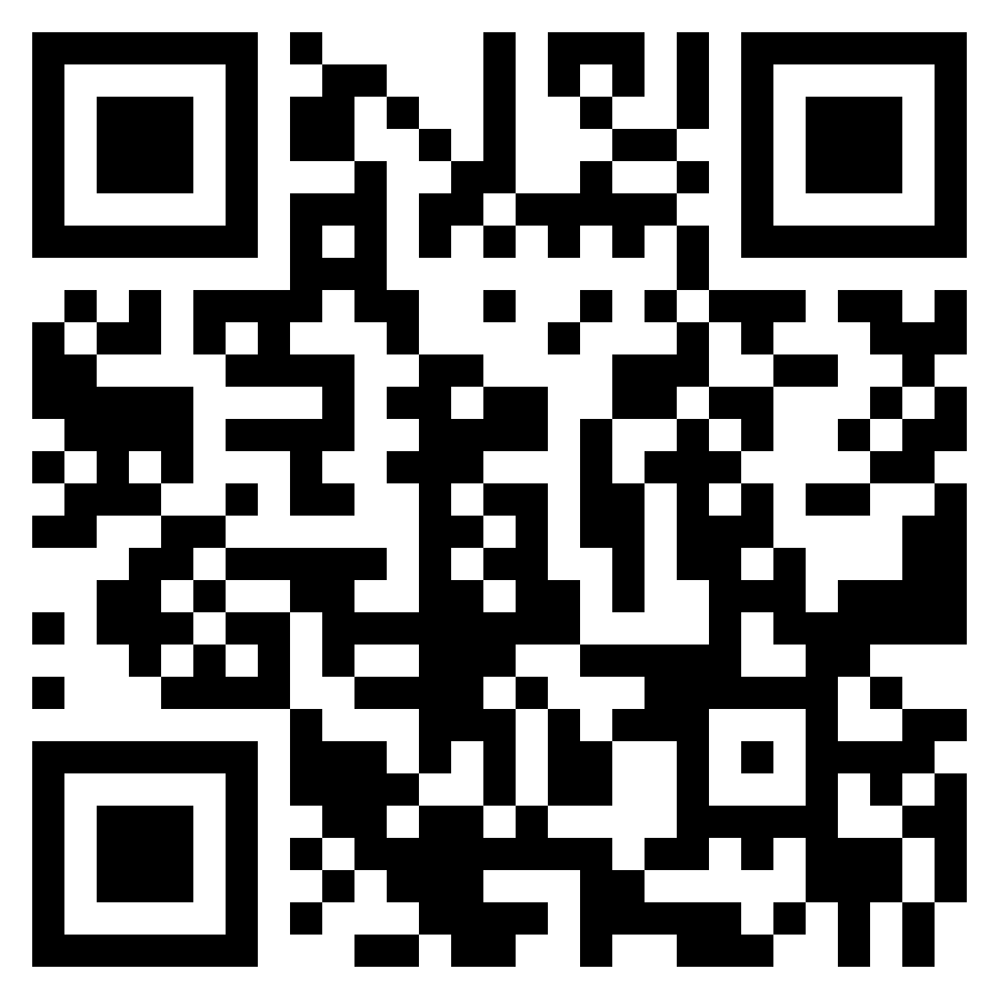
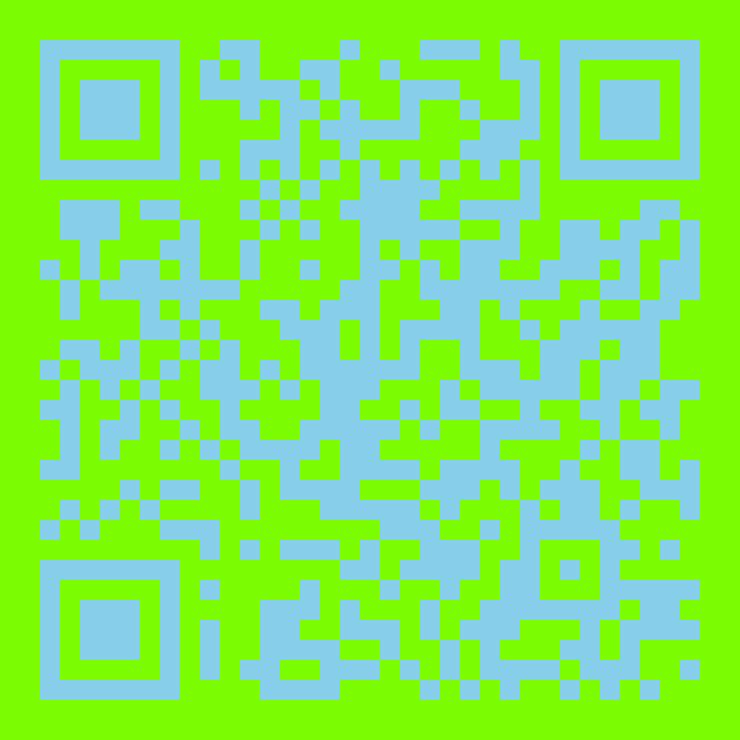
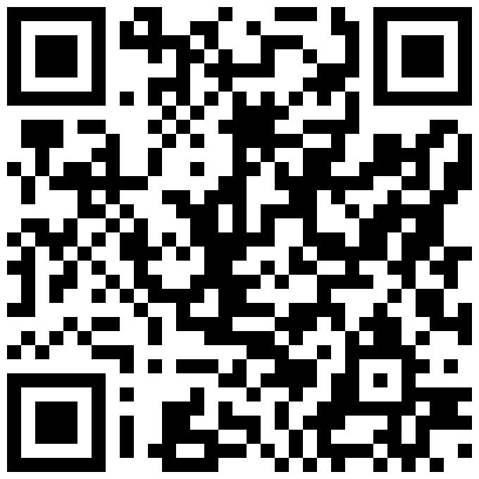
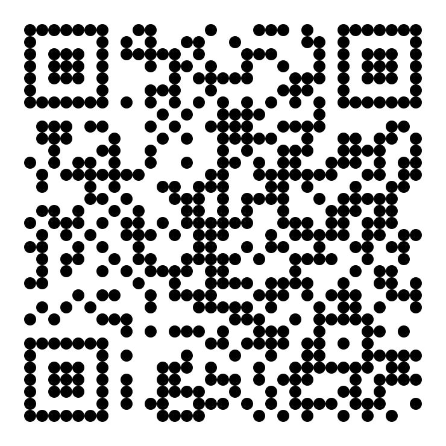
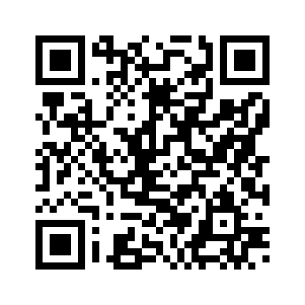
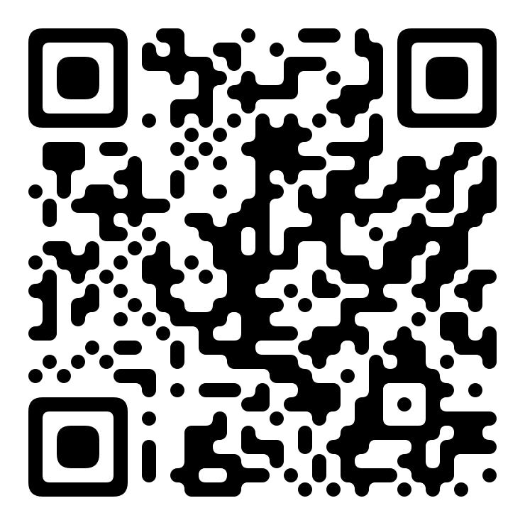

# go-qrcode #

[](https://goreportcard.com/report/github.com/yeqown/go-qrcode) 
[](https://pkg.go.dev/github.com/yeqown/go-qrcode/v2)
[](https://github.com/yeqown/go-qrcode/actions/workflows/go.yml) 


[](./LICENSE)


QR code (abbreviated from Quick Response Code) is the trademark for a type of matrix barcode (or two-dimensional barcode) first designed in 1994 for the automotive industry in Japan. A barcode is a machine-readable optical label that contains information about the item to which it is attached. A QR code uses four standardized encoding modes (numeric, alphanumeric, byte/binary, and kanji) to store data efficiently; extensions may also be used

### Features

- [x] Normally generate QR code across `version 1` to `version 40`.
- [x] Automatically analyze QR version by source text.
- [x] Specifying cell shape allowably with `WithCustomShape`, `WithCircleShape` (default is `rectangle`)
- [x] Specifying output file's format with `WithBuiltinImageEncoder`, `WithCustomImageEncoder` (default is `JPEG`)
- [x] Not only shape of cell, but also color of QR Code background and foreground color.
- [x] `WithLogoImage`, `WithLogoImageFilePNG`, `WithLogoImageFileJPEG` help you add an icon at the central of QR Code.
- [x] `WithBorderWidth` allows to specify any width of 4 sides around the qrcode.
- [x] `WebAssembly` support, check out the [Example](./example/webassembly/README.md) and [README](cmd/wasm/README.md) for more detail.
- [x] support Halftone QR Codes, check out the [Example](./example/with-halftone).
### Install

```sh
go get -u github.com/yeqown/go-qrcode/v2
```

### Quick Start

link to [CODE](./example/main.go)
```go
package main

import (
	"github.com/yeqown/go-qrcode/v2"
	"github.com/yeqown/go-qrcode/writer/standard"
)

func main() {
	qrc, err := qrcode.New("https://github.com/yeqown/go-qrcode")
	if err != nil {
		fmt.Printf("could not generate QRCode: %v", err)
		return
	}
	
	w, err := standard.New("../assets/repo-qrcode.jpeg")
	if err != nil {
		fmt.Printf("standard.New failed: %v", err)
		return
	}
	
	// save file
	if err = qrc.Save(w); err != nil {
		fmt.Printf("could not save image: %v", err)
	}
}
```

### Options

```go
const (
	// EncModeNone mode ...
	EncModeNone encMode = 1 << iota
	// EncModeNumeric mode ...
	EncModeNumeric
	// EncModeAlphanumeric mode ...
	EncModeAlphanumeric
	// EncModeByte mode ...
	EncModeByte
	// EncModeJP mode ...
	EncModeJP
)

// WithEncodingMode sets the encoding mode.
func WithEncodingMode(mode encMode) EncodeOption {}

const (
	// ErrorCorrectionLow :Level L: 7% error recovery.
	ErrorCorrectionLow ecLevel = iota + 1
	
	// ErrorCorrectionMedium :Level M: 15% error recovery. Good default choice.
	ErrorCorrectionMedium
	
	// ErrorCorrectionQuart :Level Q: 25% error recovery.
	ErrorCorrectionQuart
	
	// ErrorCorrectionHighest :Level H: 30% error recovery.
	ErrorCorrectionHighest
)

// WithErrorCorrectionLevel sets the error correction level.
func WithErrorCorrectionLevel(ecLevel ecLevel) EncodeOption {}
```

### Samples

> These samples are generated with standard writer, check out [Example](./example/example.go) for more details.

| A                                                                                          | B                                                                                       | C                                                                                        | D                                                                                      |
|--------------------------------------------------------------------------------------------|-----------------------------------------------------------------------------------------|------------------------------------------------------------------------------------------|----------------------------------------------------------------------------------------|
| <br>bg-fg color        | <br>transparent | <br>border padding | <br>circle shape |
| <br>fg gradient       | <br>using halftone   | <br>set logo image        | <br>block width      |
| <br>custom shape |                                                                                         |                                                                                          |                                                                                        |

<br>

### Built-in Writers

- [Standard Writer](./writer/standard/README.md), prints QRCode into file and stream
- [Terminal Writer](./writer/terminal/README.md), prints QRCode into terminal
- [File Writer](./writer/file/README.md), prints QRCode into files
- [Compressed Writer](./writer/compressed/README.md), It's generated on a very small scale

Of course, you can also code your own writer, just implement [Writer](./writer/README.md) interface.

### Migrating from v1

`go-qrcode.v2` is a major upgrade from v1, and it is not backward compatible. `v2` redesigned
the API, and it is more flexible and powerful. Features are split into different modules (according to functionality).

- github.com/yeqown/go-qrcode/v2 **_core_** 
- github.com/yeqown/go-qrcode/writer/standard **_writer/imageFile_**
- github.com/yeqown/go-qrcode/writer/terminal **_writer/terminal_**

Check [example/migrating-from-v1](./example/migrating-from-v1/main.go) for more details.

### Links

* [QRCode Tourist](https://www.thonky.com/qr-code-tutorial/)
* [QRCode Wiki](https://en.wikipedia.org/wiki/QR_code)
* [二维码详解 (QRCode analysis in CN-zh)](https://zhuanlan.zhihu.com/p/21463650)
* [数据编码 (How to encode data payload in QRCode in CN-zh)](https://zhuanlan.zhihu.com/p/25432676)
