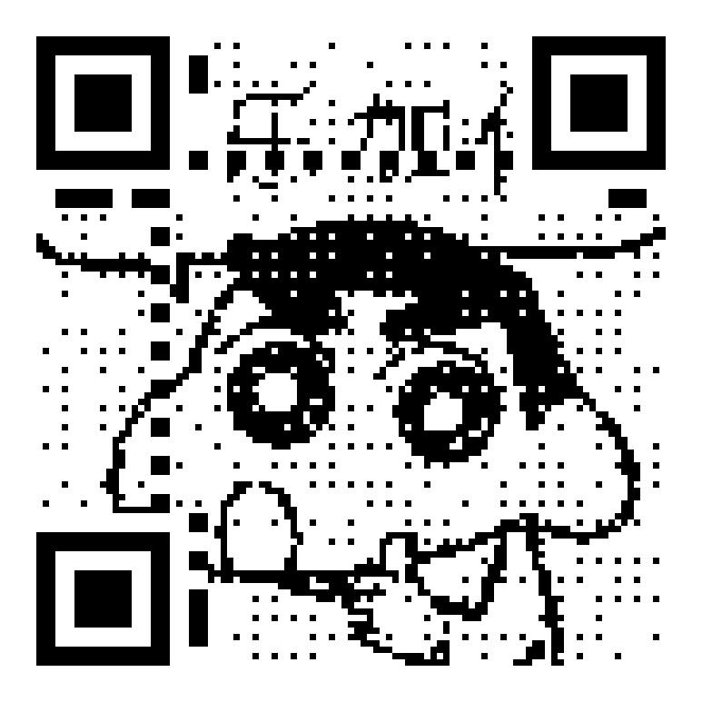

## with-halftone

> 🚧 Notice that could not use another shape except for the rectangle since
> the gap between qr blocks could mislead the recognizer.

```go

var (
	transparent = flag.Bool("transparent", false, "set background to transparent")
)

func main() {
	qrc, err := qrcode.New("https://github.com/yeqown/go-qrcode")
	if err != nil {
		panic(err)
	}
	
	options := []standard.ImageOption{
		standard.WithHalftone("./test.jpeg"),
		standard.WithQRWidth(21),
	}
	filename := "./halftone-qr.png"
	
	if *transparent {
		options = append(
			options,
			standard.WithBuiltinImageEncoder(standard.PNG_FORMAT),
			standard.WithBgTransparent(),
		)
		filename = "./halftone-qr-transparent.png"
	}
	
	w0, err := standard.New(filename, options...)
	handleErr(err)
	err = qrc.Save(w0)
	handleErr(err)
}
```

#### input image


#### output image



