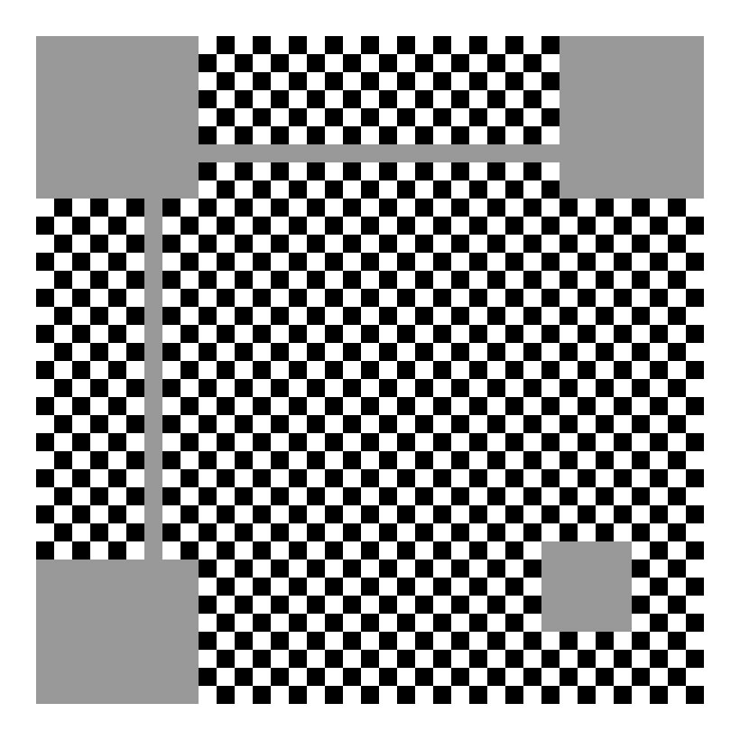
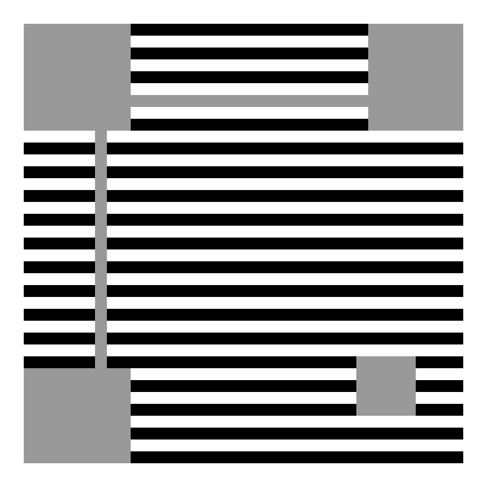
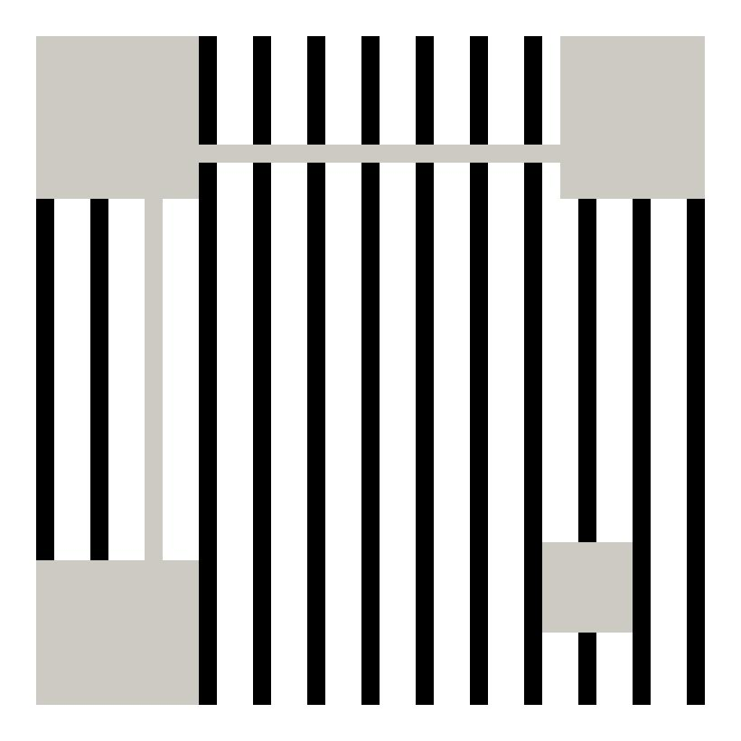
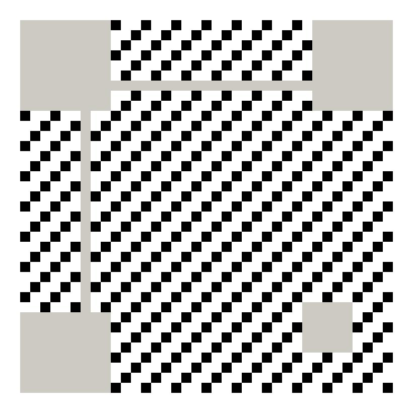
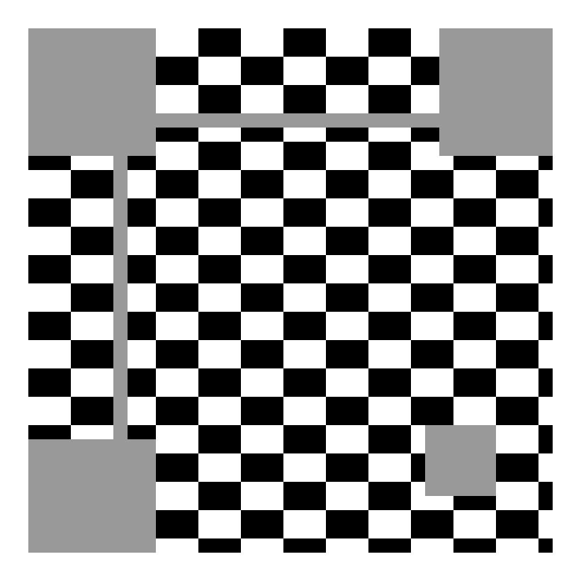
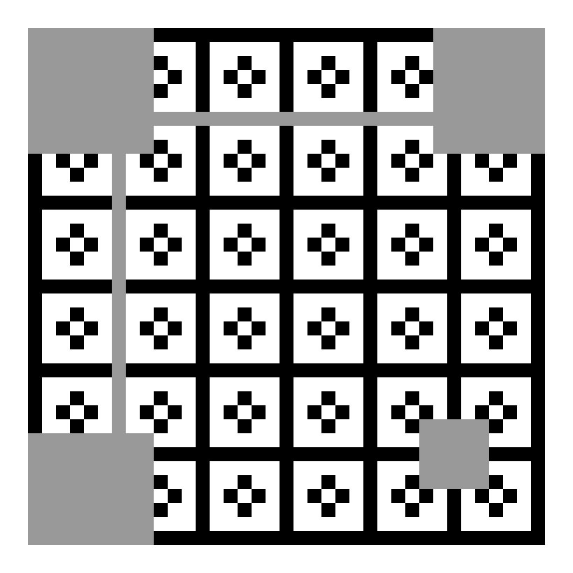
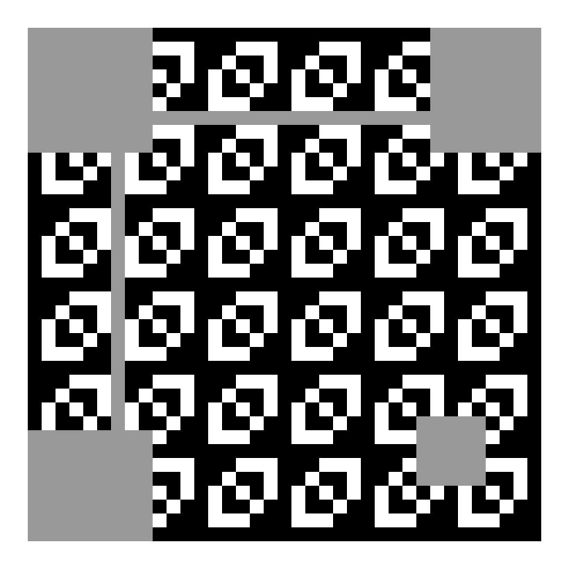
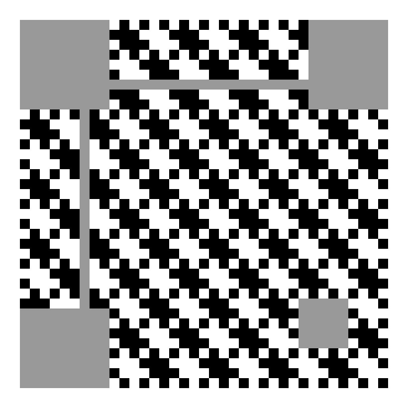

### 掩码图

##### 掩码0

计算方式：// Modulo0 (x+y) mod 2 == 0

##### 掩码1

计算方式：// Modulo1 (x) mod 2 == 0

##### 掩码2

计算方式：// Modulo2 (y) mod 3 == 0

##### 掩码3

计算方式：// Modulo3 (x+y) mod 3 == 0

##### 掩码4

计算方式：// Modulo4 (floor (x/ 2) + floor (y/ 3) mod 2 == 0

##### 掩码5

计算方式：// Modulo5 (x * y) mod 2) + (x * y) mod 3) == 0

##### 掩码6

计算方式：// Modulo6 (x * y) mod 2) + (x * y) mod 3) mod 2 == 0

##### 掩码7

计算方式：// Modulo7 (x + y) mod 2) + (x * y) mod 3) mod 2 == 0

